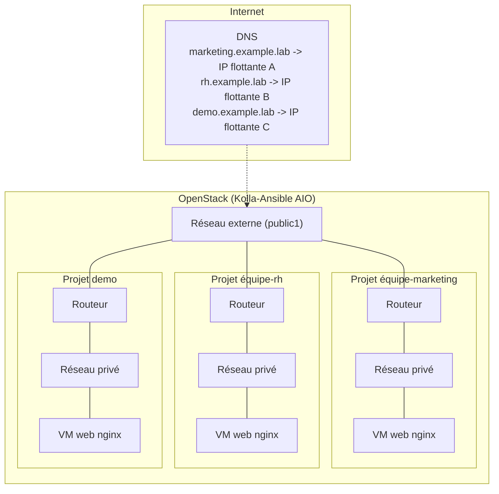

# Architecture

## Vue d'ensemble

## Pourquoi un projet OpenStack par équipe SI

Chaque équipe SI reçoit son propre **projet (tenant) Keystone**, avec :

- un réseau privé + sous-réseau + routeur dédiés,
- un quota (instances, cœurs, RAM, IP flottantes, réseaux),
- un security group dédié (SSH/HTTP/HTTPS),
- ses propres VMs.

C'est le mécanisme d'isolation natif d'OpenStack : chaque équipe ne voit et ne
gère que ses propres ressources (RBAC Keystone), sans risque qu'une équipe
sature le quota d'une autre ou n'accède à son réseau interne. C'est aussi le
pattern qui scale le mieux si l'usage grandit vers de la vraie production
(plusieurs comptes/utilisateurs par équipe, facturation par projet, etc.).

L'alternative (tout le monde dans un seul projet partagé, avec un
reverse-proxy central qui route par nom d'hôte) mutualise mieux les adresses
IP publiques mais casse l'isolation réseau et de quota entre équipes — moins
adapté à un contexte multi-équipes SI.

## Routage par nom de domaine

Dans cette maquette, chaque site web reçoit sa **propre IP flottante**
Neutron. Le nom de domaine de l'équipe est ensuite pointé (enregistrement DNS
`A`, ou une ligne `/etc/hosts` pour tester en local) directement vers cette
IP flottante. Simple, standard, et chaque site est indépendant : pas de point
de contention commun.

### Évolution possible

Si un jour la mutualisation d'une seule IP publique devient nécessaire
(pénurie d'IPv4, TLS centralisé, etc.), on peut ajouter un projet "edge"
dédié avec un reverse-proxy (nginx/Traefik) ou un load balancer Octavia en
frontal, routant par en-tête `Host` vers les VMs de chaque équipe. Cela
demanderait d'ouvrir un accès réseau du projet "edge" vers chaque réseau
privé d'équipe (peering ou IP flottantes internes) — volontairement hors
scope de la V1 pour rester simple à opérer et déboguer.

## Déploiement d'OpenStack lui-même

Kolla-Ansible All-In-One (voir [deploy/kolla-ansible/](../deploy/kolla-ansible/))
déploie tous les services OpenStack en conteneurs sur une seule machine
Linux. C'est volontairement une maquette mono-nœud : les composants
(Keystone, Nova, Neutron, Glance, Horizon) tournent tous sur le même hôte,
sans haute disponibilité. Le choix de Kolla-Ansible plutôt que DevStack est
motivé par la réutilisabilité : DevStack est pensé pour des environnements
jetables de quelques heures, alors que Kolla-Ansible est basé sur des
playbooks Ansible idempotents, redéployables à la demande — cohérent avec le
besoin de piloter cette infra "as code" depuis ce repo.
